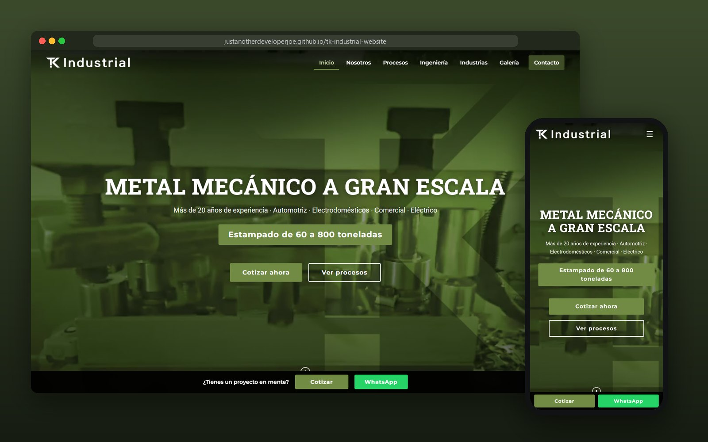
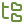

<div align="center">

# TK Industrial

**Metal mecánico a gran escala**<br>
One-page marketing site for a Nuevo León manufacturer with 20+ years in metal stamping, Metal-FAB, wire products and machining.

<br>

[](https://justanotherdeveloperjoe.github.io/tk-industrial-website/)


<br>



</div>

<br>

##  At a glance

| | |
|---|---|
| **Client** | TK Industrial, with plants in Apodaca and Ciénega de Flores, N.L. |
| **Services shown** | Stamping (60–800 Ton) · Metal-FAB · Wire products · Machining |
| **Language** | Spanish |
| **Sections** | Hero · Nosotros · Procesos · Ingeniería & herramientas · Industrias · Galería · Contacto |

##  Features

| | |
|---|---|
|  **Hero video + parallax** | The client's real plant footage drifts on scroll. It falls back to a poster photo when the video can't play and saves battery on mobile. |
|  **Safe preloader** | Hides as soon as the page loads, and never for more than 3.5 s even if an image stalls. |
|  **Frosted nav + scrollspy** | Scroll progress bar, and the nav highlights the section you're reading. |
|  **Scroll reveals** | Staggered entrances, plus counters that count the key metrics up on first view. |
|  **Gallery lightbox** | Full-size photos, with a soft fade-in so nothing pops. |
|  **Contact** | Sticky Cotizar / WhatsApp bar, phone link, and a form that opens the visitor's mail client. |
|  **Reduced motion** | Every animation respects `prefers-reduced-motion`. |

##  Run locally

No install, no build. Open `index.html`, or serve the folder:

```bash
python3 -m http.server 8000
```

##  Project structure

```
index.html     Page markup (Spanish) + SEO / Open Graph meta
styles.css     All styles
script.js      Interactions: vanilla JS, no dependencies
img/           Logos, certifications, process and product photos
video/         Hero footage (tkvideo.mp4); poster is img/tk-hero-poster.jpg
docs/          README preview
```

##  Deployment

Hosted on **GitHub Pages** from `main`. Every push redeploys it.

> [!NOTE]
> If the site moves to its own domain, update `og:url` in `index.html`.
